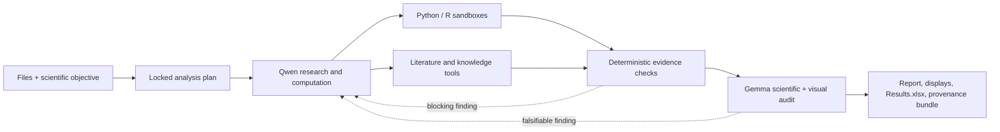

# Evidence Bench

[](https://github.com/kstawiski/evidence-gated-scientific-agent/actions/workflows/ci.yml)
[](https://github.com/kstawiski/evidence-gated-scientific-agent/releases)
[](https://www.python.org/)
[](LICENSE)

**Scientific analysis that has to show its work.**

Evidence Bench is a self-hosted workspace for evidence-gated scientific AI. It
combines local model reasoning, isolated Python and R execution, literature
retrieval, deterministic validation, independent model review, and complete run
provenance in one browser application and an Agent2Agent (A2A) 1.0 service.

[Project website][product-site] ·
[Quick start](#quick-start) ·
[Local setup guide](docs/LOCAL_SETUP.md) ·
[Documentation](#documentation) ·
[Security model](docs/THREAT_MODEL.md)

[product-site]: https://kstawiski.github.io/evidence-gated-scientific-agent/

## What Evidence Bench delivers

- **Auditable analysis workspaces.** Inputs, protocols, computation artifacts,
  sources, displays, reviews, and manifests remain together in an immutable run
  record.
- **Reader-ready result delivery.** Registered figures and full tables render in
  the article, while one consolidated `Results.xlsx`, portable Markdown report,
  and provenance bundle remain directly downloadable.
- **Independent execution and review.** Qwen plans, retrieves, computes, and
  drafts. Gemma independently audits the plan, scientific report, tables, and
  rendered figures.
- **Deterministic acceptance rules.** Python code—not model agreement—controls
  tool policy, method-lock checks, claim-to-source traceability, statistical
  consistency, display registration, and final status.
- **Real scientific computing.** Python and R run in confined workers with
  read-only inputs, offline execution, resource limits, and append-only outputs.
- **Grounded literature work.** Typed PubMed acquisition, an instance-local
  knowledge library, managed Chromium research, and optional Model Context
  Protocol (MCP) connections preserve the exact evidence used by a report.
- **Live, inspectable progress.** The WebUI streams phases, bounded tool events,
  visible model output, generated files, figures, and tables without exposing
  chain-of-thought or credentials.
- **Portable integration.** Use the browser, REST API, A2A 1.0 endpoint, CLI, or
  the bundled Codex/Claude skill and dependency-free A2A client.

## How it works



1. **Define the task.** Upload source files and state the scientific objective,
   estimand, and requested outputs.
2. **Lock the method.** Qwen proposes a plan; deterministic linting and an
   independent Gemma audit must accept it before outcome-directed work begins.
3. **Gather evidence.** Qwen uses approved retrieval tools and confined Python/R
   workers. Every successful call records code, logs, artifacts, and hashes.
4. **Validate the report.** Claims must resolve to exact computation artifacts or
   acquired sources. Tables and figures must match registered evidence.
5. **Audit independently.** Gemma reviews the scientific argument and the actual
   raster/table displays. Blocking, actionable findings return through a bounded
   correction and re-audit cycle.
6. **Publish the record.** A supported run provides the article, source-linked
   claims, figures, tables, environment record, and a downloadable provenance
   bundle.

Human review remains required for consequential scientific and medical
decisions. Evidence Bench produces exploratory scientific reports; it does not
claim peer review, clinical authority, science lock, or submission readiness.

## Core capabilities

| Area | Product behavior |
|---|---|
| Workspaces | Isolated files, sources, runs, revisions, and bundles |
| Analysis | Confined Python/R, scripts, typed results, package environments |
| Evidence | PubMed/PMC, local knowledge, Brave, Context7, managed Chromium |
| Validation | Method lock, statistics, provenance, claims, and display checks |
| Review | Independent plan, report, raster, OCR/geometry, and table audit |
| Outputs | Article, figures, tables, PPTX, notebook, and result-data ZIP |
| Interfaces | WebUI, REST/OpenAPI, A2A 1.0, CLI, Codex/Claude skill |
| Operations | Compose, health checks, storage, cancellation, and live events |

## Quick start

### Requirements

- macOS, Linux, or Windows with WSL2
- Docker Engine/Desktop with Docker Compose v2
- local Ollama models installed by the setup script, or two existing
  OpenAI-compatible endpoints: one Qwen executor and one Gemma critic
- Linux namespace support for the confined Python/R workers (Docker Desktop
  provides it; hardened native-Linux hosts may need the troubleshooting steps in
  the [local setup guide](docs/LOCAL_SETUP.md#the-sandbox-or-another-service-is-unhealthy))

### Automatic local setup

```bash
git clone https://github.com/kstawiski/evidence-gated-scientific-agent.git
cd evidence-gated-scientific-agent
./scripts/local_setup.sh
```

The installer detects RAM and GPU VRAM, lets you choose an appropriate Qwen and
vision-capable Gemma pair, installs both through Ollama, creates a secure local
configuration, starts the released containers, and runs preflight. See the
[macOS, Linux, and WSL2 tutorial](docs/LOCAL_SETUP.md) for the profile table,
unattended setup, exact-model overrides, and troubleshooting.

### Existing model endpoints or a persistent server

The base Compose configuration builds the checked-out source. After configuring
the model endpoints and replacing every example credential, developers can run:

```bash
cp .env.example .env

# Configure the Qwen/Gemma endpoints and replace the example credentials.
docker compose up --build -d

curl http://127.0.0.1:8080/healthz
```

Open <http://127.0.0.1:8080>. The base Compose configuration binds the WebUI to
loopback. Keep it private, or place it behind an authenticated TLS reverse proxy
before exposing it beyond a trusted network.

The most important settings are documented in [`.env.example`](.env.example):

| Setting | Purpose |
|---|---|
| `QWEN_BASE_URL`, `QWEN_MODEL` | executor endpoint and model |
| `GEMMA_BASE_URL`, `GEMMA_MODEL` | independent critic endpoint and model |
| `WEB_USERNAME`, `WEB_PASSWORD` | browser and REST authentication |
| `A2A_TOKEN` | independent bearer token for A2A clients |
| `EVIDENCE_BENCH_DATA_PATH` | persistent workspace and provenance storage |
| `WEB_BIND_ADDRESS`, `WEB_PUBLISHED_PORT` | WebUI bind address and port |

Use the [local setup tutorial](docs/LOCAL_SETUP.md) for a laptop or workstation.
For released images, durable storage, upgrades, rollback, TLS termination, and
trusted-network browser access, follow the end-to-end
[persistent deployment guide](deploy/README.md).

## Ways to use Evidence Bench

### Web workbench

The browser application manages workspaces, uploads, knowledge sources, live run
monitoring, registered displays, evidence-linked reports, revisions, discussions,
and provenance downloads. OpenAPI documentation is available at `/api/docs` on
an authenticated deployment.

### REST and A2A 1.0

Every deployment exposes:

- `GET /.well-known/agent-card.json` — public A2A Agent Card
- `POST /a2a` — bearer-authenticated A2A JSON-RPC endpoint
- `POST /api/workspaces/{id}/runs` — create an audited run
- `GET /api/runs/{run_id}` — inspect current or final state
- `GET /api/runs/{run_id}/events/stream` — live Server-Sent Events
- `GET /api/runs/{run_id}/bundle` — download complete provenance
- `GET /api/integrations` — discover versioned client and skill downloads

The complete contract and examples are in
[Web, REST, and A2A](docs/WEB_AND_A2A.md).

### Command line

```bash
uv sync --extra dev --extra analysis

uv run scientific-agent run \
  --mode simple \
  --enable-code \
  --mcp context7,brave-search,chrome-devtools \
  "Analyze data/cohort.csv and independently reconcile the primary \
result in Python and R."
```

The CLI returns `0` only for a supported result, `3` when scientific uncertainty
or a required human decision remains, and `1` for an infrastructure or schema
failure.

### Codex and Claude

The [`skills/evidence-bench`](skills/evidence-bench/SKILL.md) package contains a
portable skill and standard-library client. A running deployment also generates a
versioned, checksum-protected skill archive and an A2A starter archive from its
**Skill + A2A downloads** panel. Deployment credentials are never bundled.

## The evidence contract

Evidence Bench treats a report as a projection of verified evidence, not as the
source of truth.

- A computation-backed claim must cite an artifact from a successful sandbox
  execution.
- Cross-language reconciliation binds values to exact JSON paths and SHA-256
  digests; the controller reloads both artifacts and recomputes the differences.
- Literature claims must cite controller-acquired source records. Biomedical
  runs require typed PubMed search and locally previewable evidence.
- Reader-facing figures and tables must be registered from successful artifacts,
  pass deterministic checks, and survive Gemma's independent display review.
- Failed, cancelled, stale, rejected, or superseded artifacts remain visible for
  audit but cannot support accepted claims.
- Model consensus cannot override a deterministic finding.

The full specification is in the
[reporting and evidence standard](docs/REPORTING_STANDARD.md).

## Security and privacy

Evidence Bench is designed for a trusted self-hosted environment:

- workspaces are path-confined and mutually isolated;
- analysis workers receive inputs read-only and have no network access;
- the managed browser uses a dedicated profile and a private-address-denying
  egress proxy;
- the browser's DevTools endpoint is internal and is not published to the host;
- credentials, prompts, raw private reasoning, and unapproved tool arguments are
  excluded from live events and provenance artifacts;
- cancellation is cooperative and preserves partial work as incomplete.

Read the [threat model](docs/THREAT_MODEL.md) before adapting network bindings or
using confidential inputs. Do not deploy the default workbench directly on the
public internet.

## Architecture

The default Compose application separates the public service from execution and
browser trust domains:

| Service | Responsibility |
|---|---|
| `evidence-bench` | WebUI, REST/A2A, orchestration, deterministic validation |
| `sandbox-worker` | confined Python/R execution and display inspection |
| `environment-worker` | isolated per-workspace package environments |
| `browser` | persistent Chromium research session |
| `browser-cdp-gateway` | fixed-target internal DevTools access |
| `browser-egress` | public-web-only proxy with private-address denial |

Model inference is deployment-configured and may run on separate hosts. Evidence
Bench never requires the model servers to share the application host.

## Documentation

| Guide | Contents |
|---|---|
| [Web, REST, and A2A](docs/WEB_AND_A2A.md) | API contract, live events, revisions, integrations, deployment behavior |
| [Reporting standard](docs/REPORTING_STANDARD.md) | report schema, claim traceability, validation, display audit |
| [Literature acquisition](docs/LITERATURE_ACQUISITION.md) | PubMed/PMC acquisition and managed-browser import |
| [Knowledge grounding](docs/knowledge-grounding.md) | immutable library generations, hybrid retrieval, visual indexing |
| [Threat model](docs/THREAT_MODEL.md) | trust boundaries, browser/network isolation, residual risks |
| [Local setup](docs/LOCAL_SETUP.md) | automatic Qwen/Gemma installation on macOS, Linux, and WSL2 |
| [Deployment](deploy/README.md) | environment provisioning and production Compose operation |
| [Evaluation suite](evals/README.md) | reproducible scientific and transport acceptance cases |

## Quality assurance

Continuous integration runs linting, dependency audits, the non-live test suite,
container builds, Compose validation, and an isolated browser/network smoke test.
The evaluation suite adds deployed scientific cases for known-effect recovery,
Python/R reconciliation, corrupted-input handling, PubMed/full-text grounding,
knowledge retrieval, live artifact access, and A2A transport.

```bash
uv sync --frozen --extra dev --extra analysis
uv run pytest -m "not live"
uvx ruff==0.15.21 check scientific_agent tests evals deploy skills
uvx ruff==0.15.21 format --check scientific_agent tests evals deploy skills
node --check scientific_agent/web/static/app.js
shellcheck scripts/*.sh browser/*.sh
docker compose config --quiet
docker compose -f compose.yaml -f compose.local.yaml config --quiet
```

## Contributing

Please read [CONTRIBUTING.md](CONTRIBUTING.md) and open an issue before proposing
a substantial workflow or security-boundary change. Security reports should
follow [SECURITY.md](SECURITY.md), not a public issue.

## Project and affiliation

Evidence Bench is led by [Konrad G. Stawiski](https://konsta.com.pl) at the
[Department of Biostatistics and Translational Medicine](https://biostat.umed.pl),
Medical University of Lodz.

## Citation and license

Citation metadata is provided in [CITATION.cff](CITATION.cff). Evidence Bench is
released under the [Apache License 2.0](LICENSE).
